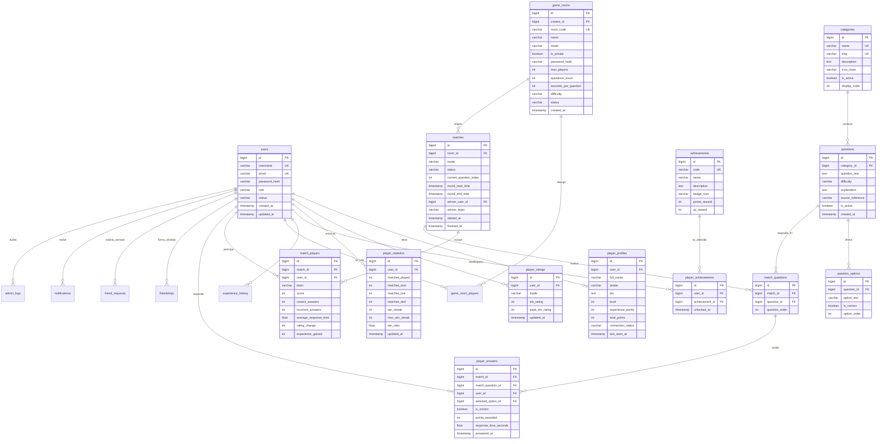

# MODELO ENTIDAD-RELACION - CULTURA PERU

El siguiente diagrama detalla la estructura relacional de la base de datos MySQL 8 del sistema.

```mermaid
erDiagram
    users ||--o{ player_profiles : "tiene"
    users ||--o{ player_ratings : "posee"
    users ||--o{ player_statistics : "acumula"
    users ||--o{ player_achievements : "desbloquea"
    users ||--o{ experience_history : "registra"
    users ||--o{ game_room_players : "se_une"
    users ||--o{ match_players : "participa"
    users ||--o{ player_answers : "responde"
    users ||--o{ friendships : "forma_amistad"
    users ||--o{ friend_requests : "solicita_amistad"
    users ||--o{ notifications : "recibe"
    users ||--o{ admin_logs : "audita"

    categories ||--o{ questions : "contiene"
    questions ||--o{ question_options : "ofrece"
    questions ||--o{ match_questions : "asignada_en"

    game_rooms ||--o{ game_room_players : "alberga"
    game_rooms ||--o{ matches : "origina"

    matches ||--o{ match_players : "incluye"
    matches ||--o{ match_questions : "evalua"
    match_questions ||--o{ player_answers : "recibe"

    achievements ||--o{ player_achievements : "es_obtenido"

    users {
        bigint id PK
        varchar username UK
        varchar email UK
        varchar password_hash
        varchar role
        varchar status
        timestamp created_at
        timestamp updated_at
    }

    player_profiles {
        bigint id PK
        bigint user_id FK
        varchar full_name
        varchar avatar
        text bio
        int level
        int experience_points
        int total_points
        varchar connection_status
        timestamp last_seen_at
    }

    categories {
        bigint id PK
        varchar name UK
        varchar slug UK
        text description
        varchar icon_class
        boolean is_active
        int display_order
    }

    questions {
        bigint id PK
        bigint category_id FK
        text question_text
        varchar difficulty
        text explanation
        varchar source_reference
        boolean is_active
        timestamp created_at
    }

    question_options {
        bigint id PK
        bigint question_id FK
        varchar option_text
        boolean is_correct
        int option_order
    }

    game_rooms {
        bigint id PK
        bigint creator_id FK
        varchar room_code UK
        varchar name
        varchar mode
        boolean is_private
        varchar password_hash
        int max_players
        int questions_count
        int seconds_per_question
        varchar difficulty
        varchar status
        timestamp created_at
    }

    matches {
        bigint id PK
        bigint room_id FK
        varchar mode
        varchar status
        int current_question_index
        timestamp round_start_time
        timestamp round_end_time
        bigint winner_user_id FK
        varchar winner_team
        timestamp started_at
        timestamp finished_at
    }

    match_players {
        bigint id PK
        bigint match_id FK
        bigint user_id FK
        varchar team
        int score
        int correct_answers
        int incorrect_answers
        float average_response_time
        int rating_change
        int experience_gained
    }

    match_questions {
        bigint id PK
        bigint match_id FK
        bigint question_id FK
        int question_order
    }

    player_answers {
        bigint id PK
        bigint match_id FK
        bigint match_question_id FK
        bigint user_id FK
        bigint selected_option_id FK
        boolean is_correct
        int points_awarded
        float response_time_seconds
        timestamp answered_at
    }

    player_ratings {
        bigint id PK
        bigint user_id FK
        varchar mode
        int elo_rating
        int peak_elo_rating
        timestamp updated_at
    }

    player_statistics {
        bigint id PK
        bigint user_id FK
        int matches_played
        int matches_won
        int matches_lost
        int matches_tied
        int win_streak
        int max_win_streak
        float win_ratio
        timestamp updated_at
    }

    achievements {
        bigint id PK
        varchar code UK
        varchar name
        text description
        varchar badge_icon
        int points_reward
        int xp_reward
    }

    player_achievements {
        bigint id PK
        bigint user_id FK
        bigint achievement_id FK
        timestamp unlocked_at
    }
```

